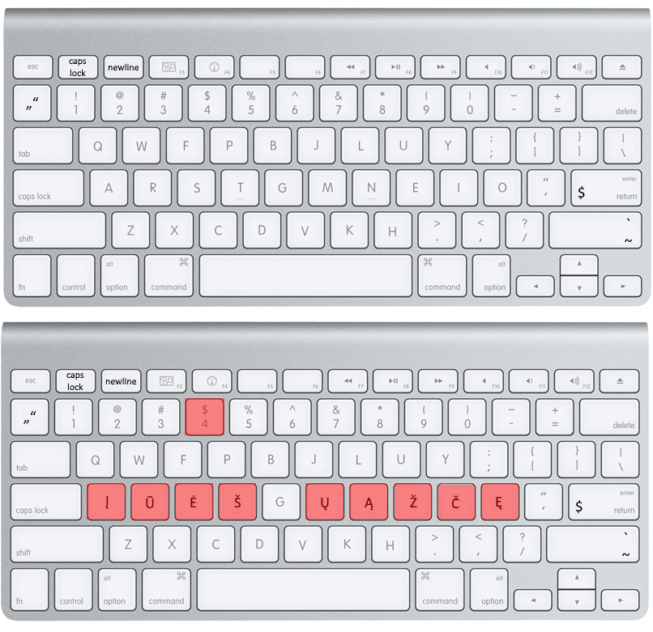

# Euromak

Euromak is not an independent keyboard layout – it is rather a mod, an additional component to already existing, ergonomic keyboard layout [Colemak-DH](https://github.com/ColemakMods/mod-dh).

# The idea behind

Many European Latin alphabet languages have keyboard layouts that can be inconvenient and challenging to use. The current layout for languages like Lithuanian,
Czech, and Slovak require multiple keystrokes and hand movements that can cause discomfort during extended typing sessions. This is because certain letters are
positioned on the number rows, making it necessary to use the AltGr key for accessing numbers, which can only be done by folding the thumb inward or by switching
the keyboard layout.  Similarly, the keyboard layouts for Romanian, Norwegian, Swedish, and Hungarian place important keys for programmers on the symbol keys,
requiring the use of the AltGr key and causing awkward hand movements that deviate from the home row.

# The compromise

In May 2022, a solution was devised to address the discomfort in typing for European Latin alphabet languages on a keyboard. The number 4 key was designated as the
most easily accessible key in the number row, which was left mostly unchanged except for number 4 which can be accessed with the left Shift key. The programming
symbols were kept in place, with the backtick and tilde keys being moved to the right Shift key, and the original key now features regional quotation marks inspired
by the Romanian keyboard layout.

This solution was written in AutoHotkey, overcoming limitations in MSKLC such as the inability to discard incorrect dead key combinations, and runs without the need
for administrator privileges, besides the recommended installation of the base Colemak-DH layout.

The Caps Lock key now switches between other languages in the mod, allowing original funcitonality to be activated either through a modifier key such as Alt, Ctrl, or
Super (Win) and Caps Lock key by pressing such combination, or by pressing the F1 key once. The F2 key is used as a newline in programs that require Shift + Enter,
and Shift + Enter now produces a dollar sign, which is useful for programmers working with languages such as PowerShell, Perl, or PHP.

The dead key combinations are organized based on bigrams, ensuring the most likely keys to be pressed next are placed on the home row for ease of typing.

For example t is most likely to be typed after š (like the word "pirštas"), therefore 4 + t outputs š. No need to switch to another key afterwards – the finger
is already on it.

# Installation (Windows)

If you would like to try out the layout without committing to a full installation, you can download the ~~"qwerty_euromak_*your language code*.exe" 
(e.g. qwerty_euromak_lt.exe) from the Releases section~~ *TODO: Right now, this option is not available. Download required files from **files > Windows** and compile AutoHotkey files with **U64 Unicode 64-bin.bin** base file.* This version of the layout is designed to work on US, UK or other English-based keyboard variants,
with the Colemak-DH base keys remapped to the corresponding QWERTY keys.

For the best experience, it is recommended to install the base Colemak-DH layout and remove any other keyboard layouts. To do this, simply run the "cm_dh_us_amd64.msi"
file from the regular releases of Euromak, which is available in an archive. After installation, restart your computer and copy the Euromak script to your desired
location. Finally, create a task in Task Scheduler and switch to the Colemak-DH base layout to use Euromak.

### Creating the task
Open Start menu

Search "Task Scheduler"

Switch to **Actions** pane

Click **Create Task...**

Name it something as "Euromak at log on"

Go to **Triggers**, click **New...**

Begin the task: **At log on**

Specific user: **[your user]**, click **OK**

Go to **Actions**, click **New...**

Program/script: **find the executable of Euromak**

Press OK, and OK once again for the final time

Done!

# Installation (Linux, X11 only)
### Works excellent, somewhat similar to Windows support (as of 2025-05-28)
* Fedora LXDE Spin

### Had also worked correctly on the following distros (as of 2025-03-20)
You will need to backtrack to a commit of the date mentioned. It is unlikely that the version as it is now would still work, as I have introduced changes that likely break support for those distros.
* Kubuntu
* EndeavourOS

Should work well on most LXDE and KDE distros, however untested. XFCE distros seemed to fail.

Clone (or download as ZIP) this repository, go to **files > Linux > Endorsed edition** and run **setup.sh**. It is recommended to double-check the script, to be aware of any potential issues that may arise during installation.

# Work in progress
Right now there are not many layouts to offer. Currently Lithuanian and Romanian layouts are available, as well as a version, which combines both and makes them
switchable within the mod (with the Caps Lock key). If you would like to contribute your language to the project, open a pull request.

If there is enough demand, I may consider creating additional layouts for popular languages. To request a new layout, simply open an issue.

Also, if there will be enough languages to be combined and used along, I might make a GUI program which makes the process less painful. Right now, the only
way to do so is by editing scripts in this repository, it shouldn't be too hard either way for the meanwhile.
